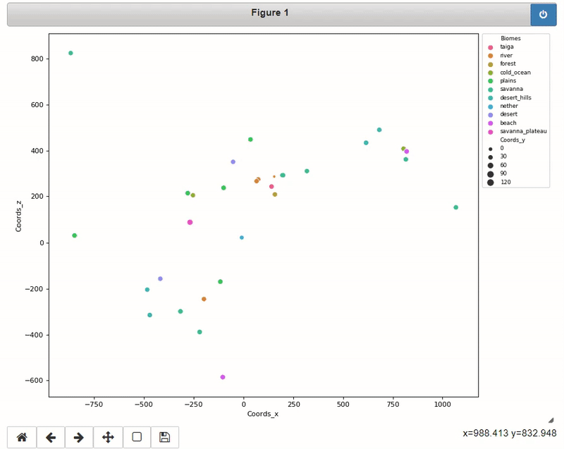

# Minecraft Mapper
Automatically obtain information from screenshots to create a map of saved landmarks

Requires Google Vision API key. <br>
Create conda environment 
```
conda env create -f mapper_env.yml
```
Run with
```
python main.py --api_key location/of/API/key.json
```
Jupyter notebook for testing prototyping during development.<br>

See Medium article: [Minecraft Mapper](https://medium.com/@robint.white90/minecraft-mapper-ab4478e98297?sk=b99f29369c15438a459b8f205881bf9a)


